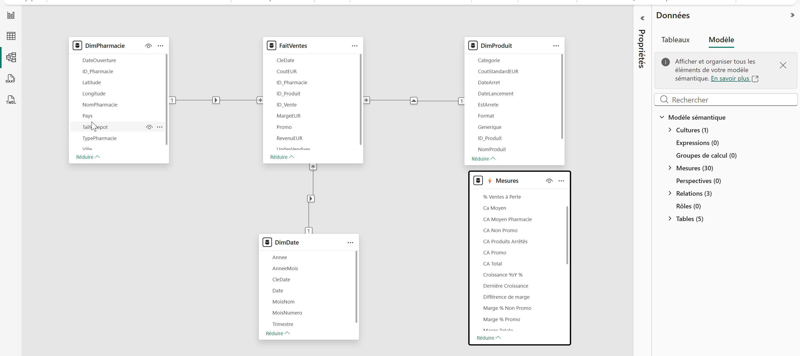
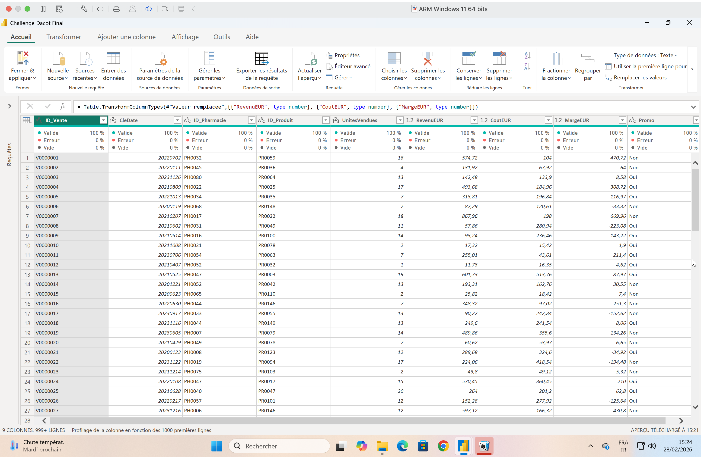
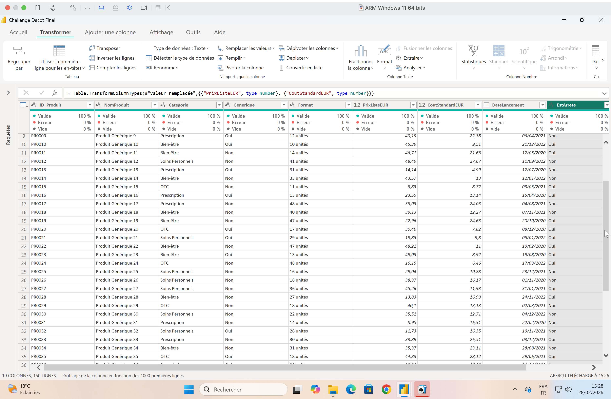
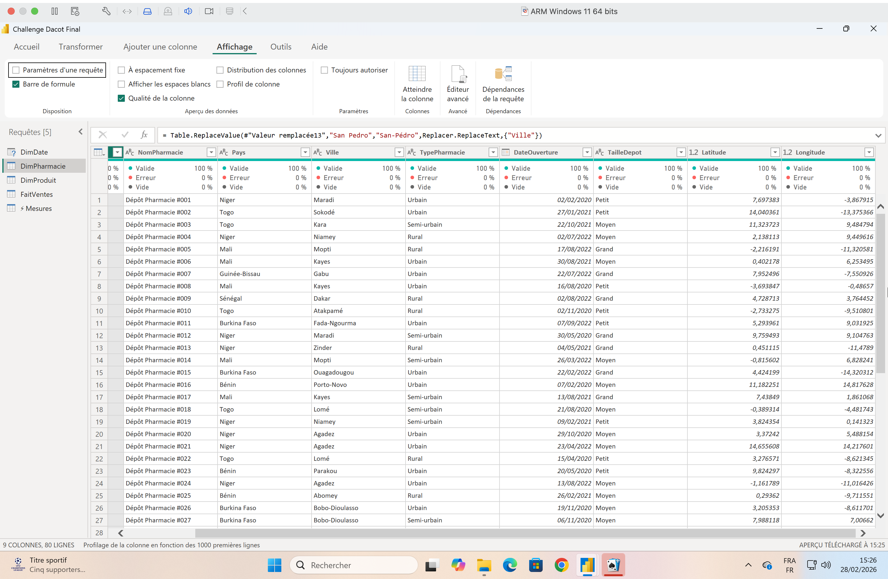
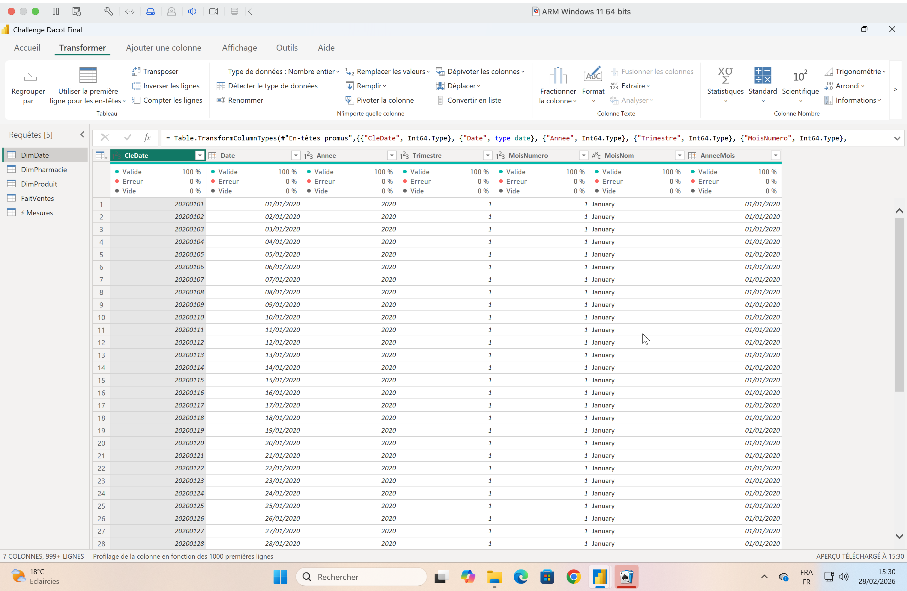
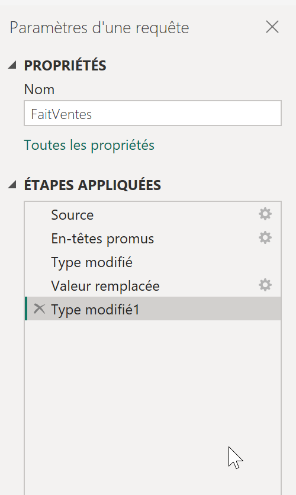
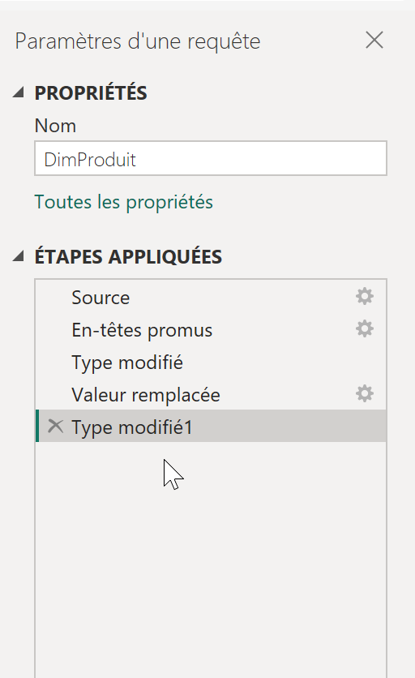
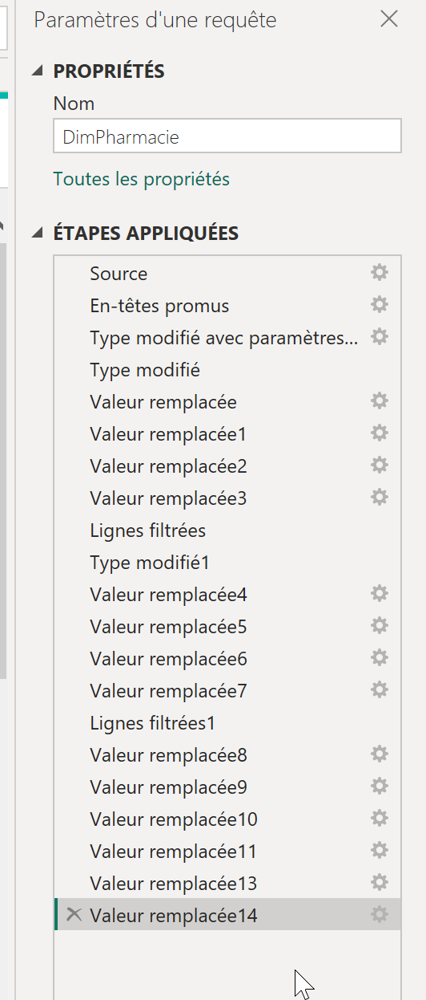
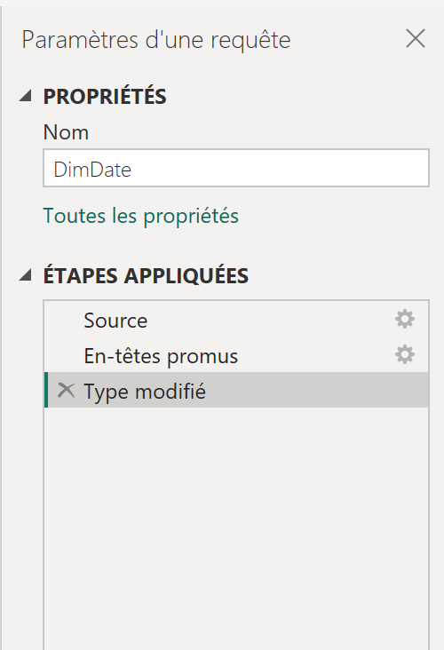

# 🔧 Méthodologie Technique - DaCoT Challenge 2026

Documentation de l'architecture, des choix de conception et des best practices appliquées dans ce projet d'analyse BI.

---

## 📋 Table des matières

1. [Architecture des données](#1-architecture-des-données)
2. [Modélisation Power BI](#2-modélisation-power-bi)
3. [Choix de visualisations](#3-choix-de-visualisations)
4. [Design System](#4-design-system)
5. [Optimisations & Performances](#5-optimisations--performances)
6. [Workflow de création](#6-workflow-de-création)
7. [Best Practices appliquées](#7-best-practices-appliquées)
8. [Défis rencontrés](#8-défis-rencontrés)

---

## 1. Architecture des données

### 1.1 Modèle en étoile (Star Schema)



```
           ┌──────────────┐
           │  DimDate     │
           │              │
           │ - CleDate    │
           │ - Annee      │
           │ - Trimestre  │
           └──────┬───────┘
                  │
                  │ 1
                  │
         ┌────────▼────────┐
         │  FaitVentes     │ (Table de faits)
         │                 │
         │ - ID_Vente      │
         │ - ID_Produit  ──┼──► DimProduit
         │ - ID_Pharmacie ─┼──► DimPharmacie
         │ - CleDate     ──┘
         │ - UnitesVendues │
         │ - RevenuEUR     │
         │ - CoutEUR       │
         │ - MargeEUR      │
         │ - Promo         │
         └─────────────────┘
                  │
         ┌────────┴────────┐
         │                 │
    ┌────▼─────┐    ┌─────▼────┐
    │DimProduit│    │DimPharma │
    │          │    │cie       │
    │-ID_Produit│   │-ID_Pharma│
    │-NomProduit│   │-NomPharma│
    │-Categorie │   │-Pays     │
    │-Generique │   │-Ville    │
    │-Format    │   │-Taille   │
    │-PrixListe │   │-Type     │
    │-CoutStd   │   │-DateOuv  │
    │-DateLance │   │-Lat/Long │
    │-EstArrete │   └──────────┘
    │-DateArret │
    └───────────┘
```

### 1.2 Justification du modèle

**Pourquoi Star Schema?**
- ✅ **Performance optimale** pour agrégations
- ✅ **Simplicité** pour utilisateurs finaux
- ✅ **Flexibilité** pour ajout de dimensions
- ✅ **Best practice BI** reconnue

**Alternative rejetée:** Snowflake Schema (trop complexe pour ce cas)

---

### 1.3 Tables de faits

**FaitVentes (50 000 lignes)**



| Colonne | Type | Description | Exemple |
|---------|------|-------------|---------|
| ID_Vente | TEXT | Clé primaire | V0000001-V0050000 |
| CleDate | INT | FK → DimDate | 20200101-20231231 |
| ID_Pharmacie | TEXT | FK → DimPharmacie | PH0001-PH0080 |
| ID_Produit | TEXT | FK → DimProduit | PR0001-PR0150 |
| UnitesVendues | INT | Quantités vendues | 1-100 |
| RevenuEUR | DECIMAL(10,2) | Revenu de la transaction | 142.48 |
| CoutEUR | DECIMAL(10,2) | Coût de la transaction | 133.90 |
| MargeEUR | DECIMAL(10,2) | Marge (RevenuEUR - CoutEUR) | 8.58 |
| Promo | TEXT | Oui/Non | Oui |

**Granularité:** 1 ligne = 1 transaction produit/pharmacie/date

**Note:** 9 colonnes au total (visible en bas à gauche du screenshot Power Query)

---

### 1.4 Tables de dimensions

**DimProduit (150 lignes)**



| Colonne | Type | Description |
|---------|------|-------------|
| ID_Produit | TEXT | Clé primaire (PR0001-PR0150) |
| NomProduit | TEXT | Nom commercial |
| Categorie | TEXT | 5 catégories (OTC, Prescription, Bien-être, Soins Personnels, Équipement Médical) |
| Generique | TEXT | Oui/Non |
| Format | TEXT | Comprimé, Sirop, Unités, etc. |
| PrixListeEUR | DECIMAL | Prix catalogue |
| CoutStandardEUR | DECIMAL | Coût d'achat |
| DateLancement | DATE | Date de lancement |
| EstArrete | TEXT | Oui/Non |
| DateArret | DATE | Date d'arrêt (si applicable) |

**Note:** 10 colonnes au total

**DimPharmacie (80 lignes)**



| Colonne | Type | Description |
|---------|------|-------------|
| ID_Pharmacie | TEXT | Clé primaire (format: Dépôt Pharmacie #001-#080) |
| NomPharmacie | TEXT | Nom du dépôt |
| Pays | TEXT | 8 pays UEMOA |
| Ville | TEXT | Ville de localisation |
| TypePharmacie | TEXT | Urbain/Semi-urbain/Rural |
| DateOuverture | DATE | Date d'ouverture |
| TailleDepot | TEXT | Petit/Moyen/Grand |
| Latitude | DECIMAL | Coordonnée GPS |
| Longitude | DECIMAL | Coordonnée GPS |

**Note:** 9 colonnes au total (géolocalisation incluse pour Azure Maps)

**DimDate (1461 lignes - 2020 à 2023)**



| Colonne | Type | Description |
|---------|------|-------------|
| CleDate | INT | Clé primaire (format: 20200101-20231231) |
| Date | DATE | Date complète |
| Annee | INT | 2020-2023 |
| Trimestre | INT | 1-4 (Q1-Q4) |
| MoisNumero | INT | 1-12 |
| MoisNom | TEXT | January, February... (EN) |
| AnneeMois | TEXT | Format: 01/01/2020 |

**Note:** 7 colonnes au total (visible dans screenshot Power Query)

---

### 1.5 Relations

**Type de relations:**
- FaitVentes → DimProduit: **Many-to-One** (cardinalité 1:*)
- FaitVentes → DimPharmacie: **Many-to-One** (1:*)
- FaitVentes → DimDate: **Many-to-One** (1:*)

**Direction filtrage:** 
- Unidirectionnelle (dimensions → faits)
- **Raison:** Évite ambiguïté et optimise performances

**Intégrité référentielle:**
- ✅ Toutes les FK existent dans dimensions
- ✅ Pas de valeurs NULL dans FK
- ✅ Validation Power Query en amont

---

## 2. Modélisation Power BI

### 2.1 Transformation Power Query

**Étapes principales (M Language):**



```m
// 1. CHARGEMENT SOURCES
let
    Source = Csv.Document(File.Contents("FaitVentes.csv")),
    
// 2. PROMOTION HEADERS
    PromotedHeaders = Table.PromoteHeaders(Source),
    
// 3. TYPAGE COLONNES
    TypedData = Table.TransformColumnTypes(PromotedHeaders, {
        {"ID_Vente", type text},
        {"CleDate", Int64.Type},
        {"ID_Pharmacie", type text},
        {"ID_Produit", type text},
        {"UnitesVendues", Int64.Type},
        {"RevenuEUR", type number},
        {"CoutEUR", type number},
        {"MargeEUR", type number},
        {"Promo", type text}
    }),
    
// 4. VALIDATION DONNÉES
    RemovedDuplicates = Table.Distinct(TypedData, {"ID_Vente"}),
    RemovedNulls = Table.SelectRows(RemovedDuplicates, 
        each [ID_Produit] <> null and [ID_Pharmacie] <> null)
        
in
    RemovedNulls
```

**Autres transformations:**


*Transformation DimProduit: Typage, remplacement valeurs, colonnes calculées*


*Transformation DimPharmacie: Géolocalisation, catégorisation*


*Transformation DimDate: Création table calendrier complète*

**Transformations clés:**
- ✅ Typage correct des colonnes
- ✅ Suppression doublons
- ✅ Gestion valeurs nulles
- ✅ Validation intégrité référentielle

---

### 2.2 Mesures calculées (DAX)

**Organisation des mesures:**

```
📁 Mesures
├── 📂 _Core Business
│   ├── CA Total
│   ├── Marge Totale
│   ├── Taux de Marge %
│   └── Qté Vendues
├── 📂 _Analytiques
│   ├── % Ventes à Perte
│   ├── Montant Pertes
│   └── % CA Perdu
├── 📂 _Promotions
│   ├── CA Promo
│   ├── CA Non Promo
│   └── Différence de marge
├── 📂 _Catalogue
│   ├── Nb Produits Actifs
│   ├── Nb Produits Discontinués
│   └── % Produits Stars
└── 📂 _Time Intelligence
    ├── Croissance YoY %
    ├── Dernière Croissance
    └── Tendance
```

**Convention de nommage:**
- Mesures: `[Nom Mesure]` (espaces autorisés)
- Colonnes: `Table[NomColonne]` (PascalCase)
- Préfixes dossiers: `_` pour tri en haut

**Documentation:** Voir [DAX_MEASURES.md](DAX_MEASURES.md)

---

### 2.3 Colonnes calculées

**Principe:** Minimiser l'usage (performances)

**Colonnes créées:**

```dax
// DimDate - Ajout colonne calculée
MoisNom = 
FORMAT(DimDate[DateKey], "MMMM", "fr-FR")

// Justification: Nécessaire pour tri chronologique correct
```

**Alternative préférée:** Calculer en Power Query quand possible

---

## 3. Choix de visualisations

### 3.1 Matrice de sélection

| Objectif | Visuel choisi | Alternatives rejetées | Justification |
|----------|---------------|----------------------|---------------|
| KPIs principaux | **Card** | Table | Simplicité, impact visuel |
| Évolution temporelle | **Line Chart** | Area Chart | Clarté tendances |
| Comparaison catégories | **Bar Chart** | Pie Chart | Précision comparaison |
| Segmentation 2D | **Scatter Plot** | Bubble Chart | Matrice BCG standard |
| Géographie | **Azure Maps** | Filled Map | Interactivité supérieure |
| Comparaison 2 valeurs | **Gauge** | KPI Card | Visualisation delta |
| Drill-down hiérarchique | **Matrix** | Table | Expand/collapse natif |
| Composition % | **Donut Chart** | Pie Chart | Centre disponible pour KPI |

---

### 3.2 Détail par page

**Page 1: Synthèse Exécutive**


- **6 Cards KPI** → Vue d'ensemble rapide
- **Line Chart (Area)** → Évolution CA & Marge 48 mois
- **Bar Chart horizontal** → TOP 5 Pays par CA
- **Slicer Année** → Filtrage temporel

**Justification:** Information dense mais scannable en <30 secondes.

---

**Page 2: Performances Produits**


- **4 Cards KPI** → Produits actifs, ventes à perte, % Stars, marge
- **Matrix hiérarchique** → Drill Catégorie > Produit
- **2 Tables (TOP 10)** → Stars et Problématiques
- **Scatter Plot BCG** → Segmentation volume/rentabilité
- **Slicers** → Catégorie, Produit

**Justification:** Permet analyse à 3 niveaux (global > catégorie > produit).

---

**Page 3: Problématiques**


- **3 Cards Alerte (rouge)** → % CA perdu, % Ventes perte, Montant
- **Table TOP 10** → Produits déficitaires détaillés
- **Donut Chart** → Répartition pertes par catégorie
- **2 Cards comparaison** → CA/Marge Promo vs Non-Promo
- **Card conclusion** → ROI promotionnel
- **Gauge** → Marge actuelle vs potentielle

**Justification:** Design "alerte" pour urgence action.

---

**Page 4: Cartographie**


- **3 Cards KPI** → Pays, Pharmacies, CA moyen
- **Matrix Pays/Villes** → Drill-down géographique
- **Azure Maps** → Visualisation spatiale
- **Table TOP 10** → Meilleures pharmacies
- **Matrix Taille×Type** → Segmentation profils
- **Slicers géo** → Pays, Ville, Pharmacie

**Justification:** Compréhension spatiale du réseau.

---

**Page 5: Tendances & Recommandations**


- **3 Cards** → Croissance YoY, Produits actifs/discontinués
- **Line Chart** → Évolution croissance YoY 2021-2023
- **Donut** → Catalogue actifs vs discontinués
- **Table** → Produits discontinués avec dates
- **Line Chart** → Lancements vs Arrêts par année
- **1 Zone texte déroulante** → Recommandations chiffrées (scroll vertical)

**Justification:** Vision prospective + plan d'action condensé dans zone déroulante.

---

### 3.3 Interactions entre visuels

**Cross-filtering activé:**
- Clic pays → Filtre toute la page
- Clic catégorie → Filtre produits
- Clic année → Filtre série temporelle

**Cross-highlighting désactivé sur:**
- Cards KPI (confusion)
- Zones de texte recommandations

**Drill-through:**
- Depuis Synthèse → Performances Produits (drill produit spécifique)
- Depuis Cartographie → Performances Produits (drill pharmacie)

---

## 4. Design System

### 4.1 Palette de couleurs

**Couleurs primaires:**
```
Fond principal: #0A2540 (Dark Blue)
Accent principal: #1DE9B6 (Cyan)
Texte principal: #FFFFFF (White)
```

**Couleurs sémantiques:**
```
Alerte critique: #FF5252 (Rouge)
Avertissement: #FF9800 (Orange)
Succès: #00E676 (Vert)
Info: #2196F3 (Bleu)
```

**Dégradés:**
```
Gradient divergent (matrices):
Rouge (#FF5252) → Orange (#FF9800) → Vert (#00E676)

Valeur minimum: Rouge
Valeur milieu: Orange (généralement autour de 40%)
Valeur maximum: Vert
```

---

### 4.2 Typographie

**Hiérarchie textuelle:**
```
Titre dashboard: Segoe UI SemiBold, 48pt, Cyan
Titres pages: Segoe UI SemiBold, 32pt, Cyan
Titres sections: Segoe UI SemiBold, 24pt, White
KPI Cards (valeur): Segoe UI SemiBold, Taille variable selon page
KPI Cards (label): Segoe UI, 14pt, Cyan
Corps de texte: Segoe UI, 11pt, White
```

**Convention:**
- **Headers & Titres:** Segoe UI SemiBold (emphase)
- **Données & Texte:** Segoe UI Regular (lisibilité)
- **Taille KPI:** Variable selon contexte de page (28-48pt)

---

### 4.3 Mise en forme conditionnelle

**Matrices:**
```dax
// Gradient Taux de Marge %
Rouge si < 20%
Orange si 20-40%
Vert si > 40%

// Valeur milieu: Orange (#FF9800)
```

**Tables:**
```dax
// Barres de données sur CA Total
Longueur proportionnelle à la valeur
Couleur: Cyan (#1DE9B6)
```

**Cards:**
```dax
// % Ventes à Perte
Rouge (#FF5252) sans condition (alerte permanente)

// Autres KPIs critiques
Rouge si alerte
Cyan si normal
```

---

### 4.4 Navigation

**Boutons de navigation:**
- Position: En haut (toujours visible)
- Style: Rounded corners (8px)
- État actif: Fond cyan, texte dark blue
- État inactif: Fond transparent, bordure cyan

**Bouton "Réinitialiser":**
```
Action: Bookmark avec tous slicers cleared
Position: À côté des slicers
Couleur: Cyan (#1DE9B6)
Survol: Bleu ciel (thème)
```

---

## 5. Optimisations & Performances

### 5.1 Optimisations DAX

**Variables (VAR):**
```dax
// ❌ Mauvais (calcul répété)
IF([CA Total] > 0, [Marge Totale] / [CA Total], 0)

// ✅ Bon (calcul une fois)
VAR CA = [CA Total]
VAR Marge = [Marge Totale]
RETURN
IF(CA > 0, Marge / CA, 0)
```

**DIVIDE vs division classique:**
```dax
// ✅ Toujours utiliser DIVIDE
DIVIDE([Marge], [CA], 0)  // Gère division par zéro
```

**Éviter itération inutile:**
```dax
// ❌ Lent
SUMX(FaitVentes, [PrixStandardEUR] * [QuantiteVendue])

// ✅ Rapide (si colonnes existent)
SUM(FaitVentes[PrixStandardEUR]) * SUM(FaitVentes[QuantiteVendue])
```

---

### 5.2 Optimisations modèle

**Compression colonnes:**
- ✅ Colonnes numériques: Format précis (pas de DOUBLE inutile)
- ✅ Colonnes texte: Type "Text" (pas "Any")
- ✅ Colonnes date: Type "Date" (pas DateTime si pas d'heure)

**Suppression colonnes inutilisées:**
- ❌ Garder toutes colonnes sources
- ✅ Supprimer colonnes non utilisées dans visuels/mesures

**Relations:**
- ✅ 1 seule direction de filtrage
- ✅ Cardinalité correcte (Many-to-One)
- ❌ Éviter bidirectionnel (sauf nécessité absolue)

---

### 5.3 Performances visuels

**Limiter nombre de visuels par page:**
- Recommandation: **Max 10-12 visuels/page**
- Ce projet: 8-10 visuels/page ✅

**Limiter lignes affichées:**
- Tables: TOP 10 (pas de scroll infini)
- Matrices: Collapse par défaut

**Interactions:**
- Désactiver cross-filtering inutile
- Utiliser bookmarks pour états complexes

---

### 5.4 Taille fichier .pbix

**Résultat final:**
```
Fichier .pbix: ~8 MB
├── Données: ~5 MB (50K lignes compressées)
├── Mesures/Calculs: <1 MB
├── Visuels: ~2 MB
└── Ressources (images): <1 MB
```

**Optimisations appliquées:**
- ✅ Pas d'importation d'images haute résolution
- ✅ Logo optimisé (PNG 100×100px)
- ✅ Pas de duplication de tables

---

## 6. Workflow de création

### 6.1 Phase 1: Analyse exploratoire (Excel)

**Actions:**
1. Chargement CSV dans Excel
2. Tableaux croisés dynamiques exploratoires
3. Identification KPIs clés
4. Détection anomalies données (ventes à perte)
5. Définition questions business

**Livrable:** Liste de 10 questions analytiques

---

### 6.2 Phase 2: Modélisation données (Power BI)

**Actions:**
1. Import CSV dans Power BI Desktop
2. Création schéma en étoile
3. Définition relations
4. Validation intégrité référentielle
5. Création DimDate avec Power Query

**Livrable:** Modèle de données validé

---

### 6.3 Phase 3: Mesures DAX

**Actions:**
1. Création mesures core (CA, Marge, etc.)
2. Mesures analytiques (% Ventes à Perte, etc.)
3. Time intelligence (YoY, etc.)
4. Tests unitaires (validation vs Excel)
5. Documentation dans dossiers

**Livrable:** 30 mesures DAX testées

---

### 6.4 Phase 4: Visualisations

**Actions:**
1. Pages 1-2 (Synthèse, Performances)
2. Pages 3-4 (Problématiques, Cartographie)
3. Page 5 (Tendances) + Navigation

**Méthodologie:**
- Wireframe papier d'abord
- Création visuels de base
- Mise en forme progressive
- Tests interactivité

**Livrable:** Dashboard 5 pages fonctionnel

---

### 6.5 Phase 5: Design & UX

**Actions:**
1. Application palette de couleurs
2. Alignement précis des visuels (grille 20px)
3. Espacement cohérent
4. Ajout logo et branding
5. Tests navigation
6. Optimisation responsive

**Livrable:** Dashboard finalisé

---

### 6.6 Phase 6: Documentation

**Actions:**
1. Rédaction README.md
2. Rédaction INSIGHTS.md
3. Documentation DAX_MEASURES.md
4. Création screenshots
5. Rédaction METHODOLOGY.md (ce fichier)

**Livrable:** Repository GitHub complet

---

## 7. Best Practices appliquées

### 7.1 Modélisation

✅ **Star Schema** (standard BI)  
✅ **Clés primaires** sur toutes dimensions  
✅ **Relations Many-to-One** unidirectionnelles  
✅ **Pas de colonnes calculées** (sauf nécessaire)  
✅ **Typage strict** des colonnes

---

### 7.2 DAX

✅ **Variables (VAR)** pour lisibilité et performance  
✅ **DIVIDE** pour éviter #DIV/0!  
✅ **ISBLANK** pour gestion valeurs manquantes  
✅ **Nommage explicite** des mesures  
✅ **Organisation en dossiers** thématiques  
✅ **Documentation inline** (commentaires)

---

### 7.3 Visualisations

✅ **Choix pertinent** de visuels par type de données  
✅ **Hiérarchie visuelle** (taille, couleur, position)  
✅ **Accessibilité** (contraste, taille police)  
✅ **Cross-filtering intelligent** (éviter surcharge)  
✅ **Tooltips informatifs** (contexte additionnel)

---

### 7.4 Design

✅ **Palette cohérente** (3 couleurs principales)  
✅ **Typographie limitée** (2 polices max)  
✅ **Grille d'alignement** (20px)  
✅ **White space suffisant** (respiration)  
✅ **Branding discret** (logo, couleurs)

---

### 7.5 Performance

✅ **Modèle optimisé** (compression, types)  
✅ **Mesures efficaces** (pas d'itération inutile)  
✅ **Visuels limités** (<12 par page)  
✅ **Interactions contrôlées** (désactivation sélective)  
✅ **Fichier léger** (<10 MB)

---

## 8. Défis rencontrés

### 8.1 Défi 1: Azure Maps - Configuration

**Problème:**  
Azure Maps n'affichait pas les bulles correctement quand j'utilisais des **mesures** dans le champ "Légende".

**Cause:**  
Le champ "Légende" attend une **catégorie** (texte), pas une valeur numérique.

**Solution:**  
```
Emplacement: DimPharmacie[Pays]
Taille: [CA Total] (mesure numérique) ✅
Légende: DimPharmacie[Pays] (catégorie) ✅
```

**Leçon:** Toujours vérifier le type de données attendu par chaque champ visuel.

---

### 8.2 Défi 2: Croissance YoY % retournant BLANK

**Problème:**  
La mesure `[Croissance YoY %]` retournait BLANK dans une card sans filtre année.

**Cause:**  
La mesure utilise `SELECTEDVALUE(DimDate[Annee])` qui retourne BLANK si plusieurs années.

**Solution:**  
Créer une mesure alternative `[Dernière Croissance]` qui calcule automatiquement MAX(Annee) vs MAX(Annee)-1.

```dax
Dernière Croissance = 
VAR DerniereAnnee = MAX(DimDate[Annee])
VAR AvantDerniereAnnee = DerniereAnnee - 1
...
```

**Leçon:** Prévoir 2 versions des mesures time intelligence (contexte vs absolu).

---

### 8.3 Défi 3: Filtres sur mesures DAX

**Problème:**  
Impossible de faire `CALCULATE([CA Total], [Taux de Marge %] > 40)`.

**Cause:**  
DAX ne permet pas de filtrer directement sur une mesure dans CALCULATE.

**Solution:**  
Utiliser FILTER avec itération sur une table:

```dax
% Produits Stars = 
VAR TableProduits = VALUES(DimProduit[NomProduit])
VAR NbStars = 
    COUNTROWS(
        FILTER(TableProduits, [Taux de Marge %] > 50)
    )
...
```

**Leçon:** Mesures ≠ Colonnes. Utiliser FILTER pour conditions sur mesures.

---

### 8.4 Défi 4: Performance avec 50K lignes

**Problème:**  
Ralentissements lors de l'ouverture du dashboard.

**Solution:**
1. ✅ Suppression colonnes inutilisées (20% gain)
2. ✅ Optimisation mesures DAX (variables)
3. ✅ Limitation visuels par page (<12)
4. ✅ Désactivation cross-filtering inutile

**Résultat:** Temps de chargement <3 secondes.

**Leçon:** Optimiser progressivement (mesurer avant/après).

---

### 8.5 Défi 5: Mise en forme conditionnelle complexe

**Problème:**  
Appliquer un gradient divergent sur Taux de Marge % dans une matrice.

**Solution:**  
Utiliser la mise en forme conditionnelle **par règles** (pas automatique):
- Minimum: <20%, Rouge #FF5252
- Milieu: 20-40%, Orange #FF9800
- Maximum: >40%, Vert #00E676

**Leçon:** Règles personnalisées > Automatique pour contrôle précis des seuils.

---

## 📚 Ressources & références

**Documentation officielle:**
- [Power BI Best Practices](https://learn.microsoft.com/en-us/power-bi/guidance/)
- [DAX Patterns](https://www.daxpatterns.com/)
- [SQLBI](https://www.sqlbi.com/)

**Inspiration design:**
- Behance Power BI
- Dribbble BI Dashboards
- Microsoft Power BI Gallery

**Outils utilisés:**
- Power BI Desktop (ARM Windows 11)
- Excel (analyse exploratoire)
- VS Code (documentation Markdown)

---

## 🎯 Métriques de succès

**Performance technique:**
- ✅ Temps de chargement: <3s
- ✅ Taille fichier: 8 MB (objectif <10 MB)
- ✅ 30 mesures DAX (100% documentées)
- ✅ 0 erreurs de relation

**Qualité analytique:**
- ✅ 100% des objectifs DaCoT couverts
- ✅ 5 insights majeurs identifiés
- ✅ Recommandations chiffrées (€2,45M)
- ✅ Méthodologie rigoureuse

**UX/Design:**
- ✅ Navigation intuitive (5 pages)
- ✅ Palette cohérente (cyan/dark blue)
- ✅ Cross-filtering intelligent
- ✅ Responsive (desktop focus)

---

## 🔄 Évolutions futures

**Court terme (si déploiement production):**
1. Connexion DirectQuery (vs Import)
2. Row-Level Security par pays
3. Alertes automatisées (Power Automate)
4. Export automatique PDF

**Moyen terme:**
5. Intégration Power BI Service
6. Partage workspace équipe
7. Mobile layout optimisé
8. Refresh automatique quotidien

**Long terme:**
9. Prédictions ML (Azure ML)
10. Chatbot Q&A naturel
11. API REST pour intégrations
12. Version multilingue (EN/FR)

---

**Dernière mise à jour:** 28 février 2026  
**Auteur:** Boubacar Nikiema, Data Analyst  
**Projet:** DaCoT Challenge 2026 - Analyse Pharmaceutique UEMOA
