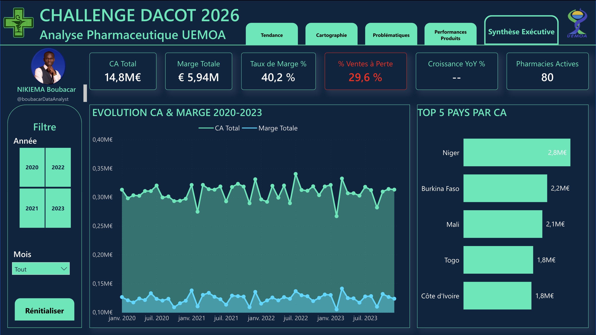
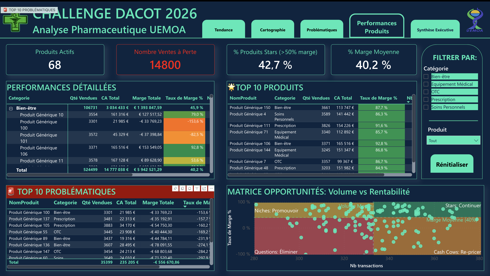
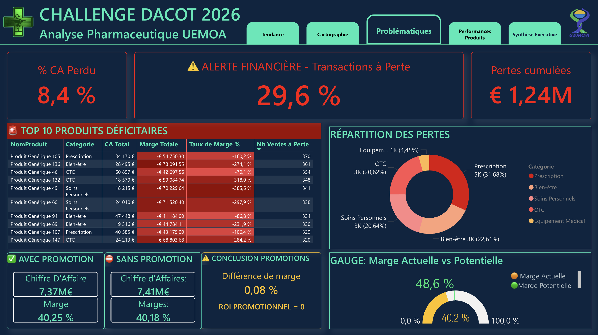
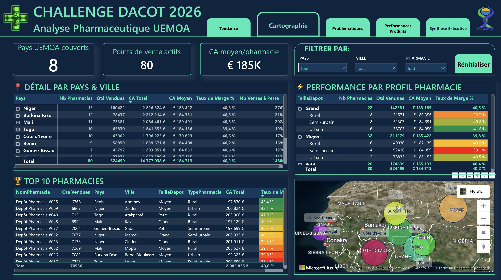
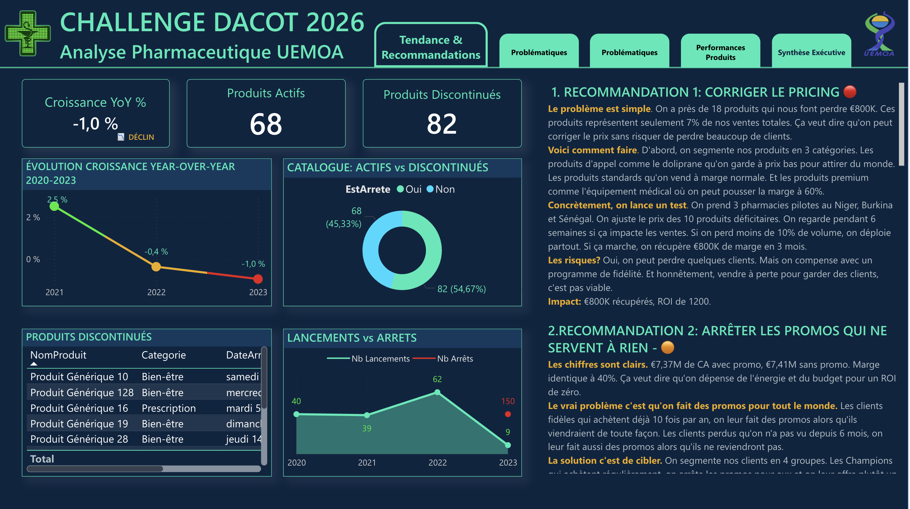

# 🏥 DaCoT Challenge 2026: Analyse Pharmaceutique UEMOA



## 📊 Vue d'ensemble

Analyse complète des performances commerciales d'un réseau de **80 pharmacies** réparties dans **8 pays de l'UEMOA** sur la période 2020-2023. Ce projet identifie les leviers stratégiques pour inverser le déclin commercial et optimiser la rentabilité.

**Problématique identifiée:**
- Déclin de **-1,0%** en 2023 (2e année consécutive)
- **€1,24M de pertes** sur transactions à marge négative
- **29,6%** des ventes réalisées à perte

**Impact des recommandations:** +€2,45M de marge potentielle sur 24 mois

---

## 🎯 Objectifs du projet

✅ Identifier les produits les plus vendus et les plus rentables  
✅ Analyser l'impact des promotions sur les marges  
✅ Comparer les performances par taille, type et localisation  
✅ Cartographier les ventes par pays et ville  
✅ Suivre les tendances de lancement et discontinuation  
✅ Proposer un plan d'action chiffré et priorisé

---

## 📈 Résultats clés

### Diagnostic

**Financier:**
- CA Total: **€14,8M** (2020-2023)
- Marge Totale: **€5,94M** (40,2%)
- Pertes cumulées: **€1,24M** (8,4% du CA)
- Ventes à perte: **29,6%** des transactions

**Produits:**
- 68 produits actifs, 82 discontinués
- 42,7% de produits "Stars" (>50% marge)
- TOP 10 produits déficitaires: **€574K de pertes**

**Géographie:**
- 8 pays UEMOA, 80 pharmacies
- CA moyen/pharmacie: **€185K** (4 ans), soit **€46K/an**
- Top pays: Niger (€2,8M), Burkina Faso (€2,2M), Mali (€2,1M)

**Insights critiques:**
- ROI promotionnel = **0,08%** ≈ 0 (promotions inefficaces)
- Sénégal sous-exploité: **6 pharmacies** pour 18M habitants
- Catalogue déséquilibré: 150 arrêts en 2023 vs 9 lancements

### Recommandations

| # | Action | Impact | Délai | Priorité |
|---|--------|--------|-------|----------|
| 1 | Re-pricing stratégique (20-30 produits) | €800K | 3 mois | 🔴 Critique |
| 2 | Programme loyalty vs promos | €250K/an | Immédiat | 🔴 Critique |
| 3 | Expansion Sénégal (pilote + scale) | +€117K | 24 mois | 🟢 Moyenne |
| 4 | Optimisation catalogue (focus Stars) | +2-3pts marge | 6 mois | 🟢 Moyenne |
| 5 | Transformation data-driven | Gains efficacité | 12 mois | 🟢 Fondation |

**Impact total estimé:** €2,45M sur 24 mois

---

## 🛠️ Stack technique

**Business Intelligence:**
- Power BI Desktop (ARM Windows 11 64 bits)
- DAX (30 mesures calculées)
- Power Query (M language)

**Visualisations:**
- Scatter Plot (Matrice BCG)
- Azure Maps (cartographie géographique)
- Gauges, KPI Cards, Matrices hiérarchiques
- Line Charts, Donut Charts, Tables conditionnelles

**Données:**
- 50 000 transactions (FaitVentes)
- 150 produits (DimProduit)
- 80 pharmacies (DimPharmacie)
- Calendrier 2020-2023 (DimDate)
- Modèle en étoile (star schema)

---

## 📸 Aperçu du Dashboard

### Page 1: Synthèse Exécutive

Vue d'ensemble avec KPIs clés, évolution CA/Marge, top pays

### Page 2: Performances Produits

Analyse détaillée par produit, matrice BCG, top/bottom performers

### Page 3: Problématiques

Focus sur les pertes, analyse promotions, potentiel récupérable

### Page 4: Cartographie

Distribution géographique, analyse par profil pharmacie

### Page 5: Tendances & Recommandations

Évolution catalogue, plan d'action chiffré

---

## 📚 Documentation détaillée

📊 **[Business Insights](INSIGHTS.md)** - Analyse approfondie des résultats et méthodologie  
💻 **[Mesures DAX](DAX_MEASURES.md)** - Code complet des 30 mesures calculées  
🔧 **[Guide Technique](METHODOLOGY.md)** - Architecture, choix de conception, best practices

---

## 🗂️ Structure du repository

```
dacot-challenge-uemoa/
├── README.md                    # Ce fichier
├── INSIGHTS.md                  # Business insights détaillés
├── DAX_MEASURES.md              # Toutes les mesures DAX
├── METHODOLOGY.md               # Méthodologie technique
├── data/
│   ├── DimProduit.csv          # Catalogue produits
│   ├── DimPharmacie.csv        # Réseau pharmacies
│   ├── FaitVentes.csv          # Transactions
│   └── DimDate.csv             # Calendrier
├── screenshots/
│   ├── page1_synthese.png
│   ├── page2_produits.png
│   ├── page3_problematiques.png
│   ├── page4_cartographie.png
│   └── page5_recommandations.png
└── pbix/
    └── DaCoT_Dashboard.pbix    # Fichier Power BI
```

---

## 🎓 Compétences démontrées

**Business Intelligence:**
- Analyse exploratoire et diagnostic business
- Création de dashboards décisionnels
- Storytelling avec les données
- Recommandations stratégiques chiffrées

**Techniques:**
- Modélisation dimensionnelle (star schema)
- DAX avancé (time intelligence, filtres complexes)
- Visualisation de données (choix pertinents)
- UX/UI design (navigation intuitive)

**Business Acumen:**
- Analyse de rentabilité produit
- Segmentation client (RFM implicite)
- Optimisation pricing
- Scoring géographique pour expansion

---

## 🎬 Vidéo Walkthrough

📺 [Voir la vidéo complète sur YouTube](https://youtube.com/@boubacarDataAnalyst)

Dans cette vidéo de 20 minutes, je détaille:
- Le contexte et la problématique business
- La méthodologie d'analyse
- Les 5 pages du dashboard
- Les insights clés et recommandations
- Les leçons apprises

---

## 👤 Auteur

**Boubacar Nikiema**  
Data Analyst | Business Intelligence Specialist

*"L'Alex The Analyst de l'espace francophone"*

📧 Email: contact@ngroup.media  
💼 LinkedIn: [linkedin.com/in/boubacar-nikiema](https://linkedin.com/in/boubacar-nikiema)  
🎥 YouTube: [@boubacarDataAnalyst](https://youtube.com/@boubacarDataAnalyst)  
🌐 Portfolio: [ngroup.media](https://ngroup.media)

---

## 📄 Licence & Données

**Données:** Synthétiques, générées pour le DaCoT Challenge 2026  
**Code:** Open source (MIT License)  
**Dashboard:** Reproduction autorisée avec attribution

---

## 🙏 Remerciements

Challenge organisé par [Organisation DaCoT]  
Inspiration méthodologique: Alex The Analyst, Luke Barousse

---

## 📌 Tags

`#PowerBI` `#DataAnalytics` `#BusinessIntelligence` `#DAX` `#UEMOA` `#Pharmaceutique` `#Dashboard` `#DataVisualization` `#BI` `#Analytics`

---

**⭐ Si ce projet t'a été utile, n'hésite pas à laisser une étoile!**
